# x402-shield

**HTTP 402 priority gate for Solana RPC nodes** — entry point to the
**Trust Layer for AI agents on Solana**. Turn spam defense into revenue;
build cross-operator reputation that compounds with every paid request.

> *"It's not an error — it's an automated economic negotiation."*

> *"It's not an error — it's an automated economic negotiation."*

---

## The problem

Public Solana RPC nodes get hammered by spam. The status-quo defense is per-IP rate limiting, which punishes legitimate AI agents that rotate infrastructure (Lambda, containers, cloud bursting). Meanwhile, DDoS is pure cost to the operator — unmonetizable.

## The solution

**x402-shield** is a reverse proxy that sits in front of any Solana RPC and enforces payment-gated priority under load:

1. Agent sends a regular JSON-RPC request.
2. Under load, the shield responds `HTTP 402 Payment Required` with a signed challenge (destination, amount, nonce, TTL).
3. Agent signs the challenge payload with its Ed25519 key — the same key that funds its pre-deposited escrow.
4. Agent retries with `Authorization: x402 <sig>.<pubkey>.<msg>`.
5. Shield verifies signature + nonce + escrow balance, debits the fee, and forwards to the upstream RPC.

Three properties fall out:

- **Sovereign Access** — No API keys, no IP whitelists. Agents are identified cryptographically by their pubkey.
- **Dynamic Backpressure** — Not a binary drop. Price scales with load; under capacity, requests pass for free.
- **Aligned Incentives** — Spam defense becomes revenue. Attackers pay the operator to keep attacking.

---

## Quick start

```bash
git clone https://github.com/flavioparah/x402-priority-protocol.git
cd x402-priority-protocol
npm install

# Start the shield (defaults: port 3000, proxies to mainnet-beta)
REAL_RPC_URL=https://api.devnet.solana.com \
PAYMENT_DESTINATION=YourSolWalletHere \
npm start
```

Hit the proxy without payment — if the sliding-window load is above the threshold, the Shield answers with a 402 challenge. For a guaranteed 402 on every request (useful for demos) start the Shield with `RPC_LOAD_FORCE=1`:

```bash
curl -i -X POST http://localhost:3000/rpc \
  -H 'Content-Type: application/json' \
  -d '{"jsonrpc":"2.0","id":1,"method":"getHealth","params":[]}'
```

```
HTTP/1.1 402 Payment Required
X-x402-Payment-Destination: YourSolWalletHere
X-x402-Amount: 12500
X-x402-Nonce: a1b2c3d4e5f6...
X-x402-Nonce-TTL: 30
```

Below the load threshold the request passes through transparently to the upstream RPC.

---

## Client SDK

The TypeScript client extends `@solana/web3.js` `Connection` — existing code only needs to swap the constructor:

```ts
import { X402Provider } from './x402-client-sdk';
import { Keypair, PublicKey } from '@solana/web3.js';

const connection = new X402Provider(
  'http://localhost:3000/rpc',
  Keypair.fromSecretKey(/* agent's secret key */),
  {
    priorityBudget: 10_000,      // max µ-lamports the agent will pay per request
    settlementMode: 'offchain',  // only mode supported today; on-chain TBD
    onChallenge: (c) => c.amount_micro_lamports < 5_000, // approve/veto per-request
  }
);

// Use like any Connection — 402 challenges are handled transparently
const info = await connection.request('getAccountInfo', [publicKey.toBase58()]);
```

On a 402, the SDK parses the challenge, optionally prompts the caller via `onChallenge`, signs the payload, and retries — all invisible to the caller.

---

## Architecture



### Components

| File | Role |
|------|------|
| `index.js` | x402-Shield proxy server (Express + `http-proxy-middleware`) |
| `x402-client-sdk.ts` | `X402Provider extends Connection` — drop-in replacement |
| `x402-guia-implementacao.docx` | Implementation guide (PT-BR) |
| `x402_protocol_architecture.svg` | Protocol flow diagram |

### Settlement modes

| Mode | Latency | Trust model |
|------|---------|-------------|
| `offchain` *(default, MVP)* | Sub-millisecond verification | Agent pre-funds a pubkey-indexed escrow; each request debits via a signed Ed25519 nonce |
| `onchain` | Seconds (confirmation) | Agent sends `SystemProgram.transfer` and the Shield verifies the tx on-chain (reserved, see below) |

### Escrow deposits

Two endpoints, both credit the caller's escrow balance in µ-lamports (1 lamport = 1000 µL by the Shield's convention):

| Endpoint | Request body | Trust |
|---|---|---|
| `POST /escrow/deposit` | `{ "tx_signature": "<base58>" }` | **Verified.** Shield fetches the tx from `SOLANA_RPC_URL`, asserts a `SystemProgram.transfer` to `PAYMENT_DESTINATION` exists, checks the signature hasn't been used before, and credits the sender's escrow at 1 lamport = 1000 µL. End-to-end example in [`examples/deposit-with-tx.js`](./examples/deposit-with-tx.js). |
| `POST /escrow/deposit-trusted` | `{ "pubkey": "...", "amount_micro_lamports": N }` | **Trusted.** No on-chain check; credits whatever the caller claims. Mounts only if `ESCROW_TRUST_DEPOSITS=1`. Intended for tests, benchmarks, and the Trust-Score progression demo. Never enable in production. |

### Anti-replay

Nonces are issued per-challenge, stored in-memory with a 30-second TTL. Consumed nonces are flagged `used` and subsequent presentations are rejected.

---

## Configuration

All configurable via env vars (see `index.js`):

| Var | Default | Purpose |
|-----|---------|---------|
| `PORT` | `3000` | Listen port |
| `REAL_RPC_URL` | `https://api.mainnet-beta.solana.com` | Upstream RPC the Shield proxies to |
| `SOLANA_RPC_URL` | `$REAL_RPC_URL` | RPC the Shield uses to *verify deposits* (can differ from proxy target) |
| `PAYMENT_DESTINATION` | `YourSolAddressHere` | Node operator's Solana wallet (must be a real pubkey for verified deposits) |
| `DEPOSIT_COMMITMENT` | `confirmed` | Commitment required on a deposit tx before it credits escrow |
| `ESCROW_TRUST_DEPOSITS` | `unset` | `1` mounts `/escrow/deposit-trusted` (no on-chain check) for tests/demos |
| `RPC_LOAD_THRESHOLD` | `0.75` | Load above which 402 gating activates |
| `MAX_RPS` | `50` | Req/s that equals "100 % load" for the sliding-window metric |
| `LOAD_WINDOW_MS` | `5000` | Sliding-window duration (ms) for req/s load |
| `RPC_LOAD_FORCE` | `unset` | `0..1` forces `getRpcLoad()` regardless of real traffic (demo mode) |
| `REQUESTS_PER_IP_LIMIT` | `100` | Per-IP request cap per window |
| `RATE_WINDOW_MS` | `60000` | Per-IP window (ms) |
| `BASE_PRICE` | `20000` | Min µ-lamports per priority request (= 20 lamports) |
| `MAX_PRICE` | `1000000` | Max µ-lamports at full load (= 1000 lamports) |

---

## Status

**This is a hackathon MVP, not production.** Known limitations:

- **In-memory state** — escrow, nonces, rate counters, and reputation live in `Map`/`Set`. A process restart wipes them. Use Redis for multi-instance.
- **Load metric is self-measured** — `getRpcLoad()` returns req/s served by *this Shield* over a 5-second sliding window, normalized against `MAX_RPS`. That is correlated with but not identical to the upstream RPC node's load. Multi-Shield deployments would need a shared counter (or a Prometheus scrape of the upstream node). `RPC_LOAD_FORCE=<0..1>` overrides for demos.
- **Single process** — no horizontal scaling yet; state must be shared when scaled.

---

## Roadmap

### Shipped

| Sprint | Deliverable |
|---|---|
| Sem 1 — MVP | Off-chain escrow, Ed25519 signed nonces, dynamic pricing, proxy pass-through |
| Sem 2 — Trust-Score | Reputation ledger per pubkey, score 0–100, up to 50% off via discount, hint-bound to signer pubkey. Progression: `npm run demo:trust` (22 reqs, 26.1% avg savings) |
| Sem 3 — Open-source spec | [`docs/QOS-COOPERATIVE-SPEC.md`](./docs/QOS-COOPERATIVE-SPEC.md) v1.0 + [`docs/TRUST-SCORE-RFC-DRAFT.md`](./docs/TRUST-SCORE-RFC-DRAFT.md) v0.1 |
| Sem 4-5 — QoS Path A | Standalone priority queue + rate-limited dispatcher in `qosMiddleware`. Live metrics at `/stats/qos`, dashboard at `/live`. Preserves 8.7 ms p95 |
| Sem 4-5 — QoS Path B | Cooperative subprotocol spec + operator-side reference impl (`examples/operator-qos-reference.js`) + 30s overload fallback + 60s health-check + 3-consecutive-success re-probe (`QOS_MODE=cooperative`). Validated by `npm run test:cooperative-qos` (12/12) |
| Sem 4-5 — Persistence | Redis-backed store (`lib/store.js`): escrow, nonces, reputation, used signatures. AOF + `volatile-lru` eviction. Restart-safe. Multi-instance ready (state shared); per-shield Redis sidecar in compose |
| Sem 4-5 — Atomic consume | Lua-script-backed `consumeNonceAndDebit` (and synchronous JS-tick equivalent in-memory). Race-free against double-spend. Validated by `npm run test:atomic` (5/5 in-memory) and `npm run test:atomic:redis` (7/7 against real Redis) |
| Sem 6-8 — Detection v1 | Sybil/fraud/churn signal engine ([`lib/detection.js`](./lib/detection.js), 19/19 unit tests). Per-pubkey attestation log. 5 signals from RFC §10: 2 active in single-op (`wash_payment_suspect`, `dormant_revival`), 3 pre-baked for cross-op activation when 2nd operator joins (`OPERATOR_ID` env var) |
| Sem 8 — Hardening sweep | 6 fixes from external review: atomic concurrency, Redis eviction policy, proxy hook format, QoS cooperative fallback, SDK on-chain spec cleanup, DEPLOY.md sync |
| Sem 9 — Outreach package | [`docs/outreach/`](./docs/outreach/) — operator pitch, email templates (EN/PT × 3 variants), 15 curated targets, CRM tracker, demo-call playbook |

### Public deployments

| URL | Mode | Network |
|---|---|---|
| https://x402.rpcpriority.com | Trusted-deposit demo (the 22-req Trust-Score progression runs here) | devnet upstream |
| https://x402-devnet.rpcpriority.com | On-chain verified deposits | devnet |
| https://x402-mainnet.rpcpriority.com | On-chain verified deposits | **mainnet** |

### Test suite

```
npm run test:detection          19/19   sybil/fraud/churn signals (offline, no network)
npm run test:atomic              5/5   atomic consume in-memory mode
npm run test:atomic:redis        7/7   atomic consume against real Redis (requires REDIS_URL)
npm run test:cooperative-qos    12/12  spec compliance + health-check exposure
                                ──────
                                43/43
```

### Pending — production scale (post-hackathon)

- **Multi-instance QoS coordination** — priority queue → shared Redis ZSET + Pub/Sub for cross-instance dispatch
- **Trust-Score broker as a separate service** — extract from `index.js` into a dedicated `trust-score-broker` repo, with Postgres audit log + operator API key registration
- **Federation v1.1** — peer-broker gossip protocol per RFC §9
- **Prometheus scrape of upstream** — replace self-measured load with operator's actual node metrics
- **Cross-chain via Base / Ethereum L2** — same Ed25519 keypair, same x402 headers, different upstream
- **`x402-tx` settlement on-chain per request** — currently only deposits are on-chain; per-request `SystemProgram.transfer` settlement reserved for future spec extension

---

## KPIs

- **Handshake overhead**: < 50 ms p95 over a plain proxy baseline.
- **Spam economics**: attacker cost ≥ node profit at any sustained rate.
- **Agent success rate under saturation**: ≥ 95 % (paying) vs. < 20 % (non-paying).

---

## Positioning

`x402-shield` operates at the **protocol infrastructure layer** (RPC network).

Existing x402-adjacent projects (MCPay, Latinum) operate at the **application layer** — paying for MCP-exposed services. Both layers are valid, but the RPC layer has the broader blast radius and aligns directly with operators who already monetize priority (Helius, Triton, Jito).

---

## Team

| | Role |
|---|---|
| **Flávio Furtado** | CEO — product & go-to-market |
| **João Romeiro** | CTO — architecture & implementation |
| **Felipe Cardoso** | DPO — blockchain & security |

Built for the [Colosseum Frontier Hackathon](https://arena.colosseum.org/hackathon), April–May 2026.

---

## License

Apache License 2.0 — see [LICENSE](./LICENSE). Aligns with the upstream Solana ecosystem (Solana itself and most core tooling are Apache-2.0) and carries an explicit patent grant.
