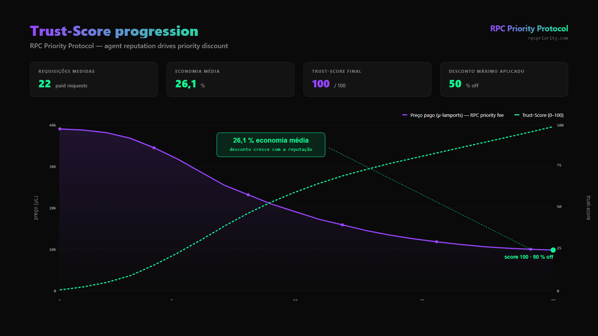

# Roteiro do Pitch — 3 minutos (RPC Priority Protocol)

> Versão **3 minutos** do pitch falado, otimizada para gravação de vídeo de submissão ou apresentação rápida em eventos. Para a versão completa de 5 minutos com Q&A, ver [`PITCH-SCRIPT-PT.md`](./PITCH-SCRIPT-PT.md).
>
> **Linguagem:** PT-BR. **Velocidade-alvo:** ~140 palavras/min. **Total:** ~410 palavras faladas.
>
> Última atualização: 2026-04-27.

---

## ⏱ Estrutura geral (timing)

| Bloco | Tempo | Speaker | O que aparece na tela |
|---|---:|---|---|
| 1. Capa + hook | 0:00–0:15 | Flávio | Slide capa (logo + tagline) |
| 2. Problema | 0:15–0:40 | Flávio | Slide rodovia + ícone IP-block riscado |
| 3. Solução em 3 batidas | 0:40–1:05 | João | Slide 3 cards + mini-diagrama do protocolo |
| 4. **Prova / demo** | 1:05–2:00 | João | **Split-screen** (ver §"O momento da demo" abaixo) |
| 5. Diferencial + mercado | 2:00–2:25 | Flávio | Slide MCPay/Latinum × nós + número EIP-1559 |
| 6. Time + ask | 2:25–3:00 | Flávio | Slide team + timeline 90 dias |

**Regra de bolso:** se passar de 3 minutos, cortar do bloco 5 (mercado), nunca da 4 (prova).

---

## Bloco 1 — Capa + hook (0:00–0:15)

🎬 **Tela:** slide capa estático.

```
┌──────────────────────────────────────────────┐
│                                              │
│         RPC Priority Protocol                │
│                                              │
│   "Não é um erro — é uma negociação          │
│    econômica automatizada."                  │
│                                              │
│    Flávio Furtado · João Romeiro             │
│    Felipe Cardoso                            │
│                                              │
│    rpcpriority.com                           │
│                                              │
└──────────────────────────────────────────────┘
```

🎙️ **Fala (Flávio):**

> *(Pausa de 1s antes de começar.)*
>
> **"Boa tarde. Sou Flávio Furtado. **RPC Priority Protocol.** A primeira camada de prioridade paga em nós RPC da Solana."**
>
> *(Pausa.)*
>
> **"Em três minutos, vou te mostrar como a gente transformou o spam que sobrecarrega o RPC em receita pro operador, e em prioridade pro agente que paga."**

📝 **Notas:** olhar fixo na câmera. Tom confiante, sem afobamento. **Plantar "RPC Priority" já no primeiro segundo.**

---

## Bloco 2 — Problema (0:15–0:40)

🎬 **Tela:** slide com ilustração da rodovia engarrafada + ícone de "placa bloqueada" (IP block) sendo riscado.

```
┌──────────────────────────────────────────────┐
│  🚗🚙🚐🚕🚌🚛  ← engarrafamento              │
│  ━━━━━━━━━━━━━━━━━━━━━━━                    │
│                                              │
│  Defesa atual:  ❌ bloquear por IP           │
│  Resultado:     prejuízo pra todos           │
└──────────────────────────────────────────────┘
```

🎙️ **Fala (Flávio):**

> **"Os nós RPC da Solana são a porta de entrada de toda aplicação na rede — todo wallet, todo dApp, todo agente IA passa por um."**
>
> *(Pausa pra a imagem se formar.)*
>
> **"Hoje, eles vivem engarrafados de spam. A defesa é bloquear por endereço de IP — mas isso pune o agente legítimo, que é um agente de IA que troca de IP a cada execução: Lambda, container, serverless."**
>
> **"E o pior: **hoje não existe um mecanismo nativo de prioridade paga em RPC.** Quem precisa de fila preferencial só consegue via API key e plano fixo mensal — não cabe num agente moderno."**

---

## Bloco 3 — Solução em 3 batidas (0:40–1:05)

🎬 **Tela:** slide com 3 cards lado a lado + mini-diagrama do handshake x402 (5 passos numerados, sem texto longo).

```
┌─────────────┬─────────────┬─────────────┐
│  IDENTIDADE │   PREÇO     │   DEFESA    │
│   por chave │  respira    │   paga a    │
│  cripto, não│  com a      │   conta     │
│   por IP    │  demanda    │             │
└─────────────┴─────────────┴─────────────┘
       │            │             │
       └────────────┼─────────────┘
                    ▼
       ┌──────────────────────┐
       │   x402 (Coinbase)    │
       │   spec aberto, HTTP  │
       └──────────────────────┘
```

🎙️ **Fala (João):**

> **"A gente construiu **a primeira camada de RPC priority na Solana.** Não bloqueia: cobra prioridade."**
>
> **"Funciona em três batidas:"**
>
> *(Apontar pros cards conforme fala.)*
>
> **"Primeira: identidade por chave criptográfica em vez de IP. Agente troca de servidor sem perder a prioridade."**
>
> **"Segunda: preço que respira com a demanda. Folgado é grátis. Cheio, cobra quem quer prioridade."**
>
> **"Terceira: defesa que paga a conta. **Atacante vira cliente involuntário do operador.**"**
>
> **"O trilho é o x402, padrão aberto da Coinbase. **A camada por cima — RPC priority — é nossa.**"**

---

## Bloco 4 — Prova / demo (1:05–2:00) ⭐

> **Esse é o bloco mais importante. 55 segundos. Não pode falhar.**

🎬 **Tela: split-screen em 2 layers + transição final.**

```
┌────────────────────────────┬────────────────┐
│                            │  ⚡ KPIs        │
│   TERMINAL (esquerda 60%)  │ ┌────────────┐ │
│                            │ │  8,7 ms    │ │
│   pre-recorded asciinema   │ │  p95       │ │
│   ou MP4 de:               │ ├────────────┤ │
│                            │ │  26,1%     │ │
│   $ npm run demo           │ │  economia  │ │
│   ── Step 1 ─ ...          │ ├────────────┤ │
│   ── Step 2 ─ ...          │ │  43 / 43   │ │
│   ── Step 3 ─ HTTP 402     │ │  testes    │ │
│   ── Step 4 ─ Ed25519 sig  │ ├────────────┤ │
│   ── Step 5 ─ accepted ✓   │ │  3 deploys │ │
│                            │ │  ao vivo   │ │
│                            │ └────────────┘ │
└────────────────────────────┴────────────────┘

   últimos 8 segundos do bloco:
   transição para fullscreen do gráfico:

┌──────────────────────────────────────────────┐
│  Trust-Score progression                     │
│                                              │
│   ▲ preço (µL)                               │
│   │ ●●                                       │
│   │   ●●                                     │
│   │     ●●●●                                 │
│   │         ●●●●●●● ──► 26,1% economia       │
│   └─────────────────────►                    │
│         requisição #                         │
└──────────────────────────────────────────────┘
```

🎙️ **Fala (João):**

> **"Tudo isso, **não é projeção. É medição. Nove semanas, do zero ao mainnet — primeira implementação de RPC priority via x402 em Solana.**"**
>
> *(Pausa. Sai pra split-screen.)*
>
> **"Olhem o terminal à esquerda. Handshake real do protocolo."**
>
> **"O agente manda uma requisição RPC. O shield responde HTTP 402, payment required, com a *challenge* assinada. O agente assina com Ed25519. O shield verifica, debita o escrow, **libera prioridade no RPC**."**
>
> *(Apontar pra coluna direita.)*
>
> **"À direita, os KPIs que provam que funciona:"**
>
> - **"Oito vírgula sete milissegundos de overhead. Meta era cinquenta. Batemos por seis."**
> - **"Vinte e seis vírgula um por cento de economia média, via Trust-Score. Cliente fiel paga até cinquenta por cento menos."**
> - **"Quarenta e três de quarenta e três testes passando. Sybil, fraude, atomic Lua sob Redis."**
> - **"Três deploys de RPC priority ao vivo: **mainnet, devnet e demo.**"**
>
> *(Transição pra gráfico fullscreen — `docs/trust-score-chart.png`.)*
>
> **"E essa é a curva. Vinte e duas requisições. Linha roxa: o preço da prioridade caindo. Linha verde tracejada: o score subindo de zero a cem. **Quanto mais você usa o RPC priority, menos você paga por ele.**"**

🎨 **O gráfico que aparece nesse momento:**



📐 **Como o gráfico foi gerado:** o arquivo HTML em [`tools/render-trust-chart.html`](../tools/render-trust-chart.html) é renderizado por Chrome headless em PNG 1600×900 px:

```bash
"/c/Program Files/Google/Chrome/Application/chrome.exe" \
  --headless --disable-gpu \
  --window-size=1600,900 \
  --hide-scrollbars \
  --screenshot="docs/trust-score-chart.png" \
  "file:///c:/projetos/x402/tools/render-trust-chart.html"
```

Pra regenerar com dados reais de outro run de `npm run demo:trust`, basta editar os arrays de coordenadas no `<svg>` do HTML e rerodar o comando.

---

## Bloco 5 — Diferencial + mercado (2:00–2:25)

🎬 **Tela:** slide com 2 colunas:

```
┌─────────────────────┬─────────────────────┐
│  Camada de          │  Camada de          │
│  APLICAÇÃO          │  PROTOCOLO          │
│                     │                     │
│  MCPay   $25k 🏆    │  RPC Priority       │
│  Latinum $25k 🏆    │  Protocol           │
│  (Colosseum 2025)   │  (← nós)            │
│                     │                     │
│  cobra pelo serviço │  cobra pelo acesso  │
│  MCP                │  à rede             │
└─────────────────────┴─────────────────────┘

         EIP-1559 já queimou
         ┌──────────────────┐
         │  US$ 11 bilhões  │
         │   em base fee    │
         └──────────────────┘
   mercado de prioridade é realidade, não hipótese
```

🎙️ **Fala (Flávio):**

> **"Por que agora? Duas coisas:"**
>
> **"Primeira: x402 é padrão novo, Coinbase 2024. Janela curta pra quem chega primeiro. Solana vive boom de agentes IA — Helius reporta bilhões de requisições RPC por mês."**
>
> **"Segunda: MCPay e Latinum, vencedores recentes do Colosseum, cobram **pela aplicação**. **A gente cobra pela prioridade no RPC.** Camada de protocolo, raio de impacto incomparavelmente maior."**
>
> **"E precedente: a EIP-1559 da Ethereum aplicou prioridade na camada de blockspace e **já queimou onze bilhões em base fee.** **A gente aplica o mesmo princípio na camada de RPC.** Mercado de prioridade é realidade, não hipótese."**

---

## Bloco 6 — Time + 90 dias + ask (2:25–3:00)

🎬 **Tela:** slide com 3 fotos + linha do tempo 90 dias.

```
┌──────────────────────────────────────────────┐
│                                              │
│  [foto]      [foto]      [foto]              │
│  Flávio      João        Felipe              │
│  CEO         CTO         DPO                 │
│  GTM         3 RFCs      Compliance          │
│                                              │
├──────────────────────────────────────────────┤
│                                              │
│  M+1 ─━━ outreach 15 ops + pitch live        │
│  M+2 ─━━ 2 pilotos fechados (rev-share)      │
│  M+3 ─━━ ⚡ GATE: 3 ops integrados?          │
│                                              │
└──────────────────────────────────────────────┘
```

🎙️ **Fala (Flávio):**

> **"Time: Flávio, CEO, go-to-market. João Romeiro, CTO, autor dos três RFCs abertos de **RPC priority**. Felipe Cardoso, DPO."**
>
> **"Em nove semanas: MVP, Trust-Score, três specs publicados, QoS dual-track, Redis multi-instance, detection v1, **três deploys de RPC priority ao vivo — incluindo o primeiro em mainnet Solana**, e outreach pra quinze operadores."**
>
> **"O que a gente pede:"**
>
> **"Colosseum: considerem Public Goods. Os três specs de **RPC priority** viram infra aberta de toda a Solana."**
>
> **"Operador: trinta dias de piloto, revenue share setenta-trinta a favor de vocês, sem fixed fee."**
>
> **"Investidor: pré-seed de cento e cinquenta a trezentos mil pra fechar três contratos em noventa dias."**
>
> *(Pausa. Sorrir.)*
>
> **"**RPC Priority Protocol** — a camada de prioridade econômica para a economia de agentes na Solana. Obrigado."**

---

## 🎬 O momento da demo — soluções concretas

> **Pergunta original:** *"Tem um momento de teste que deve aparecer. O que vai aparecer nesse momento, uma vez que não é algo gráfico com dashboard?"*
>
> Resposta: o produto **não tem GUI**. O "dashboard" do x402-shield hoje é o terminal. Mas isso não é um problema — é uma escolha. A solução é fazer o terminal **parecer um produto** com 3 elementos sobrepostos.

### Opção A — RECOMENDADA: terminal pré-gravado + overlay de KPIs + chart

**Por que recomendo:** zero risco de falha ao vivo, polido, mostra produto real, ~2h de produção.

**Como produzir:**

1. **Gravar `npm run demo`** (terminal real) com [asciinema](https://asciinema.org/) ou [OBS Studio](https://obsproject.com/) ou Loom:
   ```bash
   asciinema rec demo.cast
   npm run demo
   exit
   ```
   Resultado: ~12 segundos de output colorido com os 5 passos do handshake. Pode ser convertido em `.gif` ou `.mp4`.

2. **Card estático de KPIs** (PNG ou SVG, 350×500 px):
   ```
   ⚡ KPIs (medidos)
   ─────────────────
   8,7 ms     overhead p95
   26,1 %     economia média
   43 / 43    testes passando
   3          deploys ao vivo
   ```
   Fazer em qualquer ferramenta — Figma, Canva, Excalidraw, Keynote. 10 min.

3. **Gráfico de progressão Trust-Score:** rodar `npm run demo:trust` e capturar os números reais (já saem no terminal). Plot simples em Python (matplotlib, ~30 linhas) ou Excel:
   ```python
   import matplotlib.pyplot as plt
   prices = [40200, 39800, 38500, 36400, ..., 28900]  # do output real
   plt.plot(range(len(prices)), prices, 'o-')
   plt.xlabel("requisição #")
   plt.ylabel("preço (µ-lamports)")
   plt.title("Trust-Score progression — 26,1 % economia média")
   plt.savefig("trust-score-chart.png", dpi=150)
   ```
   30 min.

4. **Compor no editor de vídeo** (DaVinci Resolve, iMovie, Premiere): terminal recording em fullscreen → overlay do KPI card no canto superior direito → últimos 8s, fade in do chart fullscreen.

**Total:** ~2 horas de produção. Resultado: demo "que parece dashboard" sem precisar construir um dashboard.

### Opção B — Demo ao vivo com `curl` + screenshot de backup

**Por que considerar:** mais autêntico, prova que está rodando agora. Mais arriscado.

**Como produzir:**

1. Pré-staging do terminal com o `curl` já digitado (apertar Enter ao vivo):
   ```bash
   curl -sX POST https://x402-mainnet.rpcpriority.com/rpc \
     -H 'Content-Type: application/json' \
     -d '{"jsonrpc":"2.0","id":1,"method":"getHealth","params":[]}' \
     -i
   ```
2. Screenshot do gráfico Trust-Score já tirado pra mostrar em seguida.
3. Plano B: se internet falhar, tab-switch pro screenshot do 402 também pré-tirado.

**Risco:** wifi de evento, latência. **Mitigação:** terminal aberto e curl pré-digitado, basta Enter.

### Opção C — Mini-dashboard HTML simples (alta produção)

**Por que considerar:** maior wow factor; a gente já tem os endpoints.

**Como produzir:** uma página `/live` que poll `GET /stats/recent` no shield e renderiza:
- Counter de pagamentos da sessão
- Lista das últimas 5 requisições com preço + score
- Gauge de carga atual

Isso já existe **como plano** em `C:\Users\jlrom\.claude\plans\` — não foi executado. Levaria ~3-4h pra construir.

**Trade-off:** maior wow, maior trabalho, e ainda assim depende de o shield estar respondendo durante a gravação.

### Comparativo das 3 opções

| Critério | A (recomendada) | B (curl ao vivo) | C (mini-dash) |
|---|---|---|---|
| Tempo de produção | 2 h | 30 min | 3–4 h |
| Risco de falha ao gravar | 🟢 Zero | 🟡 Médio | 🟡 Médio |
| Wow factor | 🟢 Alto | 🟡 Médio | 🟢 Alto |
| Mostra produto real | ✅ Sim | ✅ Sim | ✅ Sim |
| Reproduzível em re-gravação | ✅ Trivial | 🟡 Depende rede | 🟡 Depende uptime |

---

## 🎙️ Notas finais de produção

### Áudio
- Headset mic, sala quieta, fans desligados.
- Ensaiar 3× cada bloco até falar sem ler.
- Pausas de 0,5s antes de cada número importante (8,7 / 26,1 / 43 / 3 / 11 bilhões).

### Vídeo
- 1080p mínimo. 4K se for usar zoom em terminal.
- Loom auto-captions ligadas, hand-correct termos técnicos (x402, Ed25519, Trust-Score, Lua, Redis).
- Música: nenhuma durante o bloco 4 (prova). Bed leve permitido nos demais.

### Disciplina de tempo
- Aim: 2:55. Margem: 5s.
- Acima de 3:00 = corte da submissão Colosseum. **Não negociável.**

---

**Fim.**
